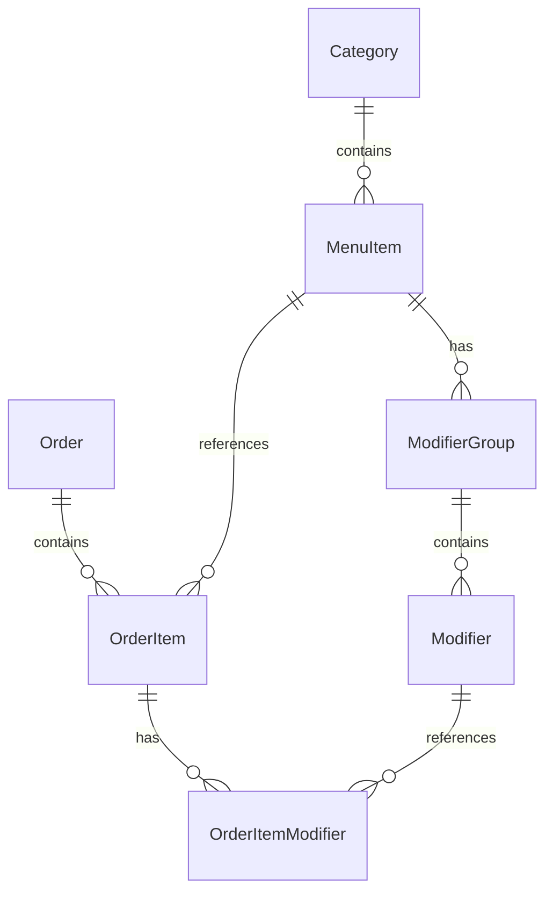

# Asian Taste Online Ordering System - PRD

> **Purpose**: This document is structured for LLM consumption to generate development tasks and implementation plans.

---

## Project Metadata

```yaml
project_name: Asian Taste Online Ordering
client: Asian Taste Vietnamese Restaurant
location: 329 Henley Beach Rd, Brooklyn Park, Adelaide SA 5032
tech_stack: React + TypeScript + Vite + ASP.NET Core 8 + PostgreSQL + Stripe API
timeline: 8 weeks MVP
status: In Development
```

---

## 1. Business Context

### Restaurant Profile
- **Cuisine**: Vietnamese, Asian fusion
- **Rating**: 4.7 stars (3,000+ Uber Eats reviews)
- **Price Range**: $7 - $23 AUD
- **Current POS**: Lightspeed Restaurant K-Series (includes payment processing + iPad POS + Kitchen Display System)
- **Current Online**: Uber Eats only (separate tablet, manual process)

### Operating Hours
| Day | Hours |
|-----|-------|
| Sunday | 10:00 AM - 8:50 PM |
| Monday - Tuesday | 10:00 AM - 2:30 PM |
| Wednesday - Saturday | 10:00 AM - 8:50 PM |

### Menu Categories
1. Banh Mi Vietnamese Meat Rolls (most popular)
2. Noodle Soup (Pho)
3. Noodle Bowl Salad
4. Rice Dishes / Rice Bowls
5. Chef's Specials (Pad Thai, Malaysian Curry)
6. Chicken Dishes
7. Beef Dishes
8. Seafood Dishes
9. Vegetable Dishes
10. Snacks (Spring Rolls, Dim Sims)
11. Drinks

### Popular Items (for "Popular" badge logic)
- Crispy Pork Roll - $10.50 (92% rating)
- Combination Roll - $11.50 (93% rating)
- Snack Super Deal (2 Spring Rolls + Drink) - $7.00 (96% rating)
- Pad Thai - $19.90
- Malaysian Curry with Rice - $19.90

---

## 2. Project Scope

### MVP Scope (In)
**Customer Ordering Web App:**
- [x] Responsive web app (mobile-first) ✅
- [x] Menu browsing with categories ✅
- [x] Item customization (modifiers, special instructions) ✅
- [x] Shopping cart (localStorage persistence) ✅
- [x] Guest checkout (no account required) ✅
- [x] Order creation (POST /api/orders) ✅
- [x] Order confirmation page (on-screen) ❌
- [ ] Stripe payment integration ❌
- [ ] Order confirmation email ❌

**Admin Order Taking Dashboard:**
- [x] Admin authentication (JWT) ✅
- [x] Restaurant dashboard (order list) ✅
- [x] Order detail view ✅
- [x] Update order status ✅
- [x] Daily order statistics ✅
- [ ] Admin menu management (CRUD) ❌
- [ ] Restaurant settings (hours, pickup time) ❌

### Future Development (Post-MVP)
- [ ] Lightspeed K-Series POS integration (order routing)
- [ ] Kitchen Display System (KDS) integration
- [ ] Uber Eats order aggregation
- [ ] Delivery management (third-party delivery services)
- [ ] Loyalty program
- [ ] SMS notifications
- [ ] Native mobile apps
- [ ] Multi-location support
- [ ] Advanced analytics and reporting

---

## 3. Technical Architecture

### Stack Decision Matrix

| Layer | Technology | Rationale |
|-------|------------|-----------|
| Frontend | React 18 + TypeScript | Industry standard, large ecosystem, fast dev |
| Build Tool | Vite | Fast HMR, optimized builds |
| UI Components | shadcn/ui + Tailwind CSS | Modern, accessible, customizable |
| State Management | Zustand | Lightweight, simple API |
| Data Fetching | React Query + Axios | Caching, optimistic updates |
| Backend API | ASP.NET Core 8 MVC Controllers | Simple, proven, easy to debug |
| Database | PostgreSQL | Open source, Azure flexible server support |
| Data Access | Dapper | Fast micro-ORM, simple SQL |
| Migrations | Raw SQL + flyway/go-migrate | Simple versioned SQL files |
| Payments | Stripe API | Industry-leading payment gateway, lower fees (1.75% + 30¢ AUD), excellent developer experience |
| Auth (Admin) | ASP.NET Identity + JWT | Battle-tested, secure, OWASP compliant |
| Hosting | Azure App Service + Azure Flexible PostgreSQL | Cost-effective, scalable |
| CDN | Azure CDN | Static assets, image delivery |

### Payment Gateway Decision: Stripe vs Lightspeed Payments

**Decision: Stripe API**

| Factor | Stripe | Lightspeed Payments |
|--------|--------|---------------------|
| Processing Fee (Australia) | 1.75% + 30¢ AUD (domestic) | ~2.4% + 30¢ AUD (typical POS rate) |
| International Cards | 2.9% + 30¢ AUD | Higher (varies) |
| Setup | API keys, no hardware required | Requires POS hardware/terminal |
| Integration Speed | 1-2 days | 5-10 days (complex API) |
| Checkout Experience | Hosted Checkout, Payment Element, Link | Integrated with POS flow |
| Recurring Payments | Supported | Limited |
| Refunds | Full API support | Via POS interface |
| Webhooks | Real-time events | Real-time events |
| Documentation | Excellent | Good (K-Series specific) |

**Rationale:**
1. **Lower transaction fees** - ~0.65% savings per transaction
2. **Faster implementation** - No POS hardware dependencies for MVP
3. **Better developer experience** - Well-documented APIs, SDKs
4. **Independent of POS** - Can implement Lightspeed POS integration later
5. **Customer experience** - Optimized checkout with Apple Pay, Google Pay, Link

### Project Structure

```
/AsianTaste.sln
├── /src
│   ├── /asian-taste-customer       # React + Vite (Customer App)
│   │   ├── /src
│   │   │   ├── /pages
│   │   │   │   ├── HomePage.tsx        # Landing/Menu
│   │   │   │   ├── MenuPage.tsx        # Menu browsing
│   │   │   │   ├── CartPage.tsx        # Shopping cart
│   │   │   │   ├── CheckoutPage.tsx    # Checkout flow
│   │   │   │   ├── ConfirmationPage.tsx # Order confirmed
│   │   │   │   └── SearchPage.tsx      # Menu search
│   │   │   ├── /components
│   │   │   │   ├── /ui                  # shadcn/ui components
│   │   │   │   ├── /layout              # Header, Footer, Layout
│   │   │   │   ├── /menu                # Menu components
│   │   │   │   │   ├── CategoryNav.tsx
│   │   │   │   │   ├── MenuGrid.tsx
│   │   │   │   │   ├── MenuItemCard.tsx
│   │   │   │   │   └── ItemDetailModal.tsx
│   │   │   │   ├── /cart                # Cart components
│   │   │   │   │   ├── CartSummary.tsx
│   │   │   │   │   └── CartItem.tsx
│   │   │   │   └── /checkout            # Checkout components
│   │   │   │       ├── CheckoutSteps.tsx
│   │   │   │       ├── ContactInfoForm.tsx
│   │   │   │       ├── PaymentMethodSelector.tsx
│   │   │   │       ├── CardPaymentForm.tsx
│   │   │   │       └── CheckoutOrderSummary.tsx
│   │   │   ├── /stores
│   │   │   │   ├── cartStore.ts         # Zustand cart state
│   │   │   │   ├── checkoutStore.ts     # Checkout state
│   │   │   │   └── searchStore.ts       # Search state
│   │   │   ├── /services
│   │   │   │   ├── client.ts            # Axios instance
│   │   │   │   ├── menuApi.ts           # Menu API calls
│   │   │   │   ├── checkoutApi.ts       # Checkout API calls
│   │   │   │   └── paymentApi.ts        # Payment API calls
│   │   │   ├── /hooks
│   │   │   │   ├── useItemSelection.ts  # Item selection logic
│   │   │   │   └── useOrderStatus.ts    # Order status tracking
│   │   │   ├── /types
│   │   │   │   └── index.ts             # TypeScript types
│   │   │   ├── App.tsx
│   │   │   └── main.tsx
│   │   ├── /public
│   │   │   └── images/
│   │   ├── package.json
│   │   ├── vite.config.ts
│   │   └── tailwind.config.js
│   │
│   ├── /asian-taste-admin         # React + Vite (Restaurant Dashboard)
│   │   ├── /src
│   │   │   ├── /pages
│   │   │   │   ├── DashboardPage.tsx   # Today's orders & stats
│   │   │   │   ├── OrdersPage.tsx      # Order list with filters
│   │   │   │   ├── OrderDetailPage.tsx # Single order details
│   │   │   │   ├── MenuManagementPage.tsx
│   │   │   │   ├── ReportsPage.tsx     # Business reports
│   │   │   │   └── SettingsPage.tsx    # Restaurant settings
│   │   │   ├── /components
│   │   │   │   ├── /layout
│   │   │   │   │   ├── AdminLayout.tsx
│   │   │   │   │   ├── Sidebar.tsx
│   │   │   │   │   └── TopBar.tsx
│   │   │   │   ├── /dashboard
│   │   │   │   │   ├── StatCard.tsx
│   │   │   │   │   ├── RevenueChart.tsx
│   │   │   │   │   └── RecentOrdersTable.tsx
│   │   │   │   ├── /orders
│   │   │   │   │   ├── OrdersTable.tsx
│   │   │   │   │   └── OrderFilters.tsx
│   │   │   │   └── /ui               # shadcn/ui components
│   │   │   ├── /services
│   │   │   │   ├── client.ts         # API client
│   │   │   │   ├── auth.ts           # Authentication APIs
│   │   │   │   ├── menuApi.ts        # Menu management APIs
│   │   │   │   └── orders.ts         # Order management APIs
│   │   │   ├── /stores
│   │   │   │   └── authStore.ts      # Auth state
│   │   │   ├── /hooks
│   │   │   │   └── useOrderWebSocket.ts # Real-time orders
│   │   │   ├── App.tsx
│   │   │   └── main.tsx
│   │   └── package.json
│   │
│   ├── /AsianTaste.API             # ASP.NET Core Web API (MVC Controllers)
│   │   ├── /Controllers
│   │   │   ├── MenuController.cs           # Menu endpoints
│   │   │   ├── OrdersController.cs         # Order CRUD
│   │   │   ├── PaymentsController.cs       # Stripe payment handling
│   │   │   ├── AuthController.cs           # Admin authentication
│   │   │   ├── WebhookController.cs        # Stripe webhooks
│   │   │   ├── AdminMenuController.cs      # Menu management
│   │   │   ├── AdminOrdersController.cs    # Order management
│   │   │   ├── AdminReportsController.cs   # Reports/analytics
│   │   │   ├── AdminSettingsController.cs  # Settings
│   │   │   ├── AdminSyncController.cs      # Lightspeed sync (future)
│   │   │   └── OAuthController.cs          # Lightspeed OAuth (future)
│   │   ├── /Services
│   │   │   ├── Payment
│   │   │   │   ├── Interfaces
│   │   │   │   ├── StripePaymentService.cs
│   │   │   │   └── PaymentGatewayFactory.cs
│   │   │   ├── Lightspeed                 # Lightspeed integration (future)
│   │   │   │   ├── ILightspeedOrderService.cs
│   │   │   │   ├── ILightspeedAuthService.cs
│   │   │   │   └── LightspeedOrderService.cs
│   │   │   ├── OrderService.cs
│   │   │   ├── JwtService.cs
│   │   │   └── Webhooks
│   │   │       └── StripeWebhookService.cs
│   │   ├── /Repositories
│   │   │   ├── IMenuRepository.cs
│   │   │   ├── IOrderRepository.cs
│   │   │   ├── IAdminRepository.cs
│   │   │   └── /Implementations
│   │   ├── /Models
│   │   │   ├── /Entities
│   │   │   ├── /DTOs
│   │   │   └── /Enums
│   │   ├── /Data
│   │   │   ├── DbConnectionFactory.cs
│   │   │   └── /Migrations
│   │   └── Program.cs
│   │
└── /tests
    ├── /AsianTaste.API.Tests
    └── /AsianTaste.Customer.Tests
```

---

## 4. Database Schema

### Entity Definitions

```csharp
// Categories
public class Category
{
    public int Id { get; set; }
    public string Name { get; set; }              // "Banh Mi Vietnamese Meat Rolls"
    public string? Description { get; set; }
    public int DisplayOrder { get; set; }
    public bool IsActive { get; set; } = true;
    public ICollection<MenuItem> MenuItems { get; set; }
}

// Menu Items
public class MenuItem
{
    public int Id { get; set; }
    public int CategoryId { get; set; }
    public string Name { get; set; }              // "Crispy Pork Roll"
    public string? Description { get; set; }
    public decimal BasePrice { get; set; }        // 10.50
    public string? ImageUrl { get; set; }
    public bool IsAvailable { get; set; } = true;
    public bool IsPopular { get; set; }           // Show "Popular" badge
    public bool IsGlutenFree { get; set; }
    public int SpicyLevel { get; set; }           // 0-3
    public Category Category { get; set; }
    public ICollection<ModifierGroup> ModifierGroups { get; set; }
}

// Modifier Groups (e.g., "Choose your protein", "Add extras")
public class ModifierGroup
{
    public int Id { get; set; }
    public int MenuItemId { get; set; }
    public string Name { get; set; }              // "Choose drink"
    public bool IsRequired { get; set; }          // Must select at least MinSelect
    public int MinSelect { get; set; }            // 1
    public int MaxSelect { get; set; }            // 1
    public MenuItem MenuItem { get; set; }
    public ICollection<Modifier> Modifiers { get; set; }
}

// Modifiers (individual options)
public class Modifier
{
    public int Id { get; set; }
    public int ModifierGroupId { get; set; }
    public string Name { get; set; }              // "Coke", "Sprite"
    public decimal PriceAdjustment { get; set; }  // 0.00 or +2.00
    public bool IsAvailable { get; set; } = true;
    public ModifierGroup ModifierGroup { get; set; }
}

// Orders
public class Order
{
    public int Id { get; set; }
    public string OrderNumber { get; set; }       // "AT-001234"
    public string CustomerName { get; set; }
    public string CustomerPhone { get; set; }
    public string CustomerEmail { get; set; }
    public OrderType OrderType { get; set; }      // Pickup, DineIn
    public DateTime RequestedTime { get; set; }   // ASAP or scheduled
    public OrderStatus Status { get; set; }       // Pending, Confirmed, Preparing, Ready, Completed, Cancelled
    public PaymentMethod PaymentMethod { get; set; } // Card, Cash
    public decimal Subtotal { get; set; }
    public decimal Tax { get; set; }              // GST if applicable
    public decimal Total { get; set; }
    public string? Notes { get; set; }

    // Lightspeed K-Series Integration Fields
    public string? ThirdPartyReference { get; set; }   // Unique reference sent to Lightspeed (our order number)
    public string? LightspeedAccountIdentifier { get; set; }  // iKentoo account identifier from webhook
    public string? LightspeedEndpointId { get; set; }  // Webhook endpoint ID used
    public string? LightspeedWebhookStatus { get; set; }  // SUCCESS, FAILURE, IN_DELIVERY, etc.
    public DateTime? LightspeedSentAt { get; set; }    // When order was sent to Lightspeed
    public DateTime? LightspeedConfirmedAt { get; set; } // When webhook confirmed order in POS
    public DateTime? LightspeedClosedAt { get; set; }   // When order was closed in POS

    public DateTime CreatedAt { get; set; }
    public DateTime? UpdatedAt { get; set; }
    public ICollection<OrderItem> Items { get; set; }
}

// Enums
public enum OrderType { Pickup, DineIn }
public enum OrderStatus { Pending, Confirmed, Preparing, Ready, Completed, Cancelled }
public enum PaymentMethod { Card, Cash }

// Order Items
public class OrderItem
{
    public int Id { get; set; }
    public int OrderId { get; set; }
    public int MenuItemId { get; set; }
    public string MenuItemName { get; set; }      // Denormalized for history
    public int Quantity { get; set; }
    public decimal UnitPrice { get; set; }
    public decimal TotalPrice { get; set; }       // (UnitPrice + modifiers) * Quantity
    public string? SpecialInstructions { get; set; }
    public Order Order { get; set; }
    public ICollection<OrderItemModifier> Modifiers { get; set; }
}

// Order Item Modifiers
public class OrderItemModifier
{
    public int Id { get; set; }
    public int OrderItemId { get; set; }
    public int ModifierId { get; set; }
    public string ModifierName { get; set; }      // Denormalized
    public decimal PriceAdjustment { get; set; }
    public OrderItem OrderItem { get; set; }
}

// Enums
public enum OrderType { Pickup, DineIn }
public enum OrderStatus { Pending, Confirmed, Preparing, Ready, Completed, Cancelled }
```

### Database Diagram (Mermaid)



### Database Schema

The database schema uses PostgreSQL with the following main entities:

**Entities:** Category, MenuItem, ModifierGroup, Modifier, Order, OrderItem, OrderItemModifier, AdminUser, LightspeedToken

**Enums:** OrderType (Pickup, DineIn), OrderStatus (Pending, Confirmed, Preparing, Ready, Completed, Cancelled), PaymentMethod (Card, Cash), PaymentStatus

See the Entity Definitions section above for the complete C# entity models. SQL migration files are located in `/src/AsianTaste.API/Data/Migrations/`.

---

## 5. API Endpoints

### Public Endpoints (No Auth)

```yaml
# Menu
GET    /api/menu                      ✅ Full menu with categories
GET    /api/menu/categories           ✅ Categories only
GET    /api/menu/categories/{categoryId}/items  ✅ Items by category
GET    /api/menu/items/{id}           ✅ Single item with modifiers
GET    /api/menu/search?q={query}     ✅ Search items
GET    /api/menu/search/advanced      ✅ Advanced search with filters
GET    /api/menu/popular              ✅ Popular items

# Orders
POST   /api/orders                    ✅ Create order
GET    /api/orders/{orderNumber}      ✅ Get order by number
GET    /api/orders/customer/{email}   ✅ Get customer order history

# Payments (Stripe)
POST   /api/payments/initiate         ✅ Initiate payment
POST   /api/payments/{paymentId}/capture  ✅ Capture authorized payment
POST   /api/payments/{paymentId}/refund    ✅ Refund payment
GET    /api/payments/{paymentId}/status    ✅ Get payment status
GET    /api/payments/order/{orderId}       ✅ Get order payment details

# Webhooks (Stripe - Public, signature verified)
POST   /api/webhook/stripe            ❌ Stripe webhook handler
GET    /api/webhook/test              ✅ Webhook endpoint test
```

### Admin Endpoints (JWT Auth Required)

```yaml
# Authentication
POST   /api/auth/login                ✅ Login, returns JWT
POST   /api/auth/validate             ✅ Validate JWT token
POST   /api/auth/refresh              ❌ Refresh JWT token
POST   /api/auth/logout               ❌ Logout (invalidate token)
POST   /api/auth/change-password      ❌ Change current password
POST   /api/auth/forgot-password      ❌ Request password reset email
POST   /api/auth/reset-password       ❌ Reset password with token

# Dashboard & Orders
GET    /api/admin/orders              ✅ Orders list with filters
GET    /api/admin/orders/{id}         ✅ Order detail
GET    /api/admin/orders/summary      ✅ Dashboard summary stats
GET    /api/admin/orders/stats/daily  ✅ Daily statistics
PUT    /api/admin/orders/{id}/status  ✅ Update order status

# Menu Management
GET    /api/admin/menu/categories     ✅ Get all categories
POST   /api/admin/menu/categories     ❌ Create category
PUT    /api/admin/menu/categories/{id}  ❌ Update category
DELETE /api/admin/menu/categories/{id}  ❌ Delete category
GET    /api/admin/menu/items          ✅ Get all items (with filters)
GET    /api/admin/menu/items/{id}     ✅ Get item by ID
POST   /api/admin/menu/items          ❌ Create item
PUT    /api/admin/menu/items/{id}     ❌ Update item
DELETE /api/admin/menu/items/{id}     ❌ Delete item
POST   /api/admin/menu/items/{id}/toggle-availability  ❌ Toggle availability
GET    /api/admin/menu/modifier-groups  ❌ Get modifier groups
POST   /api/admin/menu/modifier-groups  ❌ Create modifier group
PUT    /api/admin/menu/modifier-groups/{id}  ❌ Update modifier group
DELETE /api/admin/menu/modifier-groups/{id}  ❌ Delete modifier group

# Reports & Analytics
GET    /api/admin/reports/sales       ❌ Sales report (date range)
GET    /api/admin/reports/popular-items  ❌ Popular items report
GET    /api/admin/reports/category-sales  ❌ Category sales breakdown
GET    /api/admin/reports/hourly      ❌ Hourly order distribution

# Settings
GET    /api/admin/settings            ❌ Get restaurant settings
PUT    /api/admin/settings            ❌ Update settings
PUT    /api/admin/settings/{key}      ❌ Update single setting
GET    /api/admin/settings/hours      ❌ Get operating hours
PUT    /api/admin/settings/hours/{day}  ❌ Update operating hours

# Lightspeed Sync (Future Development)
GET    /api/oauth/status              ✅ OAuth connection status
GET    /api/oauth/authorize           ✅ Initiate OAuth flow
GET    /api/oauth/callback            ✅ OAuth callback
POST   /api/oauth/disconnect          ✅ Disconnect OAuth
POST   /api/admin/sync/order/{orderId}  ✅ Manual order sync
GET    /api/admin/sync/status          ✅ Sync statistics
POST   /api/admin/sync/retry-failed   ✅ Retry failed syncs
GET    /api/admin/sync/pending        ✅ Get pending sync orders
GET    /api/admin/sync/failed         ✅ Get failed sync orders
```

### Request/Response DTOs

```csharp
// Create Order Request
public class CreateOrderRequest
{
    public string CustomerName { get; set; }
    public string CustomerPhone { get; set; }
    public string CustomerEmail { get; set; }
    public OrderType OrderType { get; set; }
    public DateTime? RequestedTime { get; set; }  // null = ASAP
    public string? Notes { get; set; }
    public List<OrderItemDto> Items { get; set; }

    // Payment - Either Card or Cash
    public PaymentMethod PaymentMethod { get; set; }  // Card or Cash
    public string? PaymentNonce { get; set; }         // Only required for Card payments
    public string? PaymentToken { get; set; }         // Alternative to nonce for card payments
}

public class OrderItemDto
{
    public int MenuItemId { get; set; }
    public int Quantity { get; set; }
    public string? SpecialInstructions { get; set; }
    public List<int> SelectedModifierIds { get; set; }
}

// Order Response
public class OrderResponse
{
    public string OrderNumber { get; set; }
    public OrderStatus Status { get; set; }
    public DateTime EstimatedReadyTime { get; set; }
    public decimal Total { get; set; }
    public List<OrderItemResponse> Items { get; set; }
}
```

---

## 6. UI/UX Specifications

### Design System

```css
/* Color Palette - Warm Brown Theme (Tailwind config) */
{
  colors: {
    primary: '#4A3728',      /* Dark brown - headers, buttons */
    secondary: '#8B5A2B',    /* Warm brown - links, active */
    accent: '#D4A574',       /* Light brown - borders */
    background: '#FFF8F0',   /* Cream - page background */
    surface: '#FFFFFF',      /* White - cards */
    text: '#2D2D2D',         /* Near black - body text */
    'text-muted': '#6B6B6B', /* Gray - secondary text */
    success: '#2E7D32',      /* Green - add to cart, badges */
    error: '#C62828',        /* Red - errors, spicy indicator */
    warning: '#F57C00',      /* Orange - warnings */
  }
}

/* Typography */
font-heading: 'Georgia', serif;
font-body: 'Inter', sans-serif;

/* Tailwind extends standard spacing: 4px, 8px, 12px, 16px, 24px, 32px */
/* Border radius: sm, md, lg, full */
```

### Page Specifications

#### Home/Menu Page
```
Layout:
├── Header (sticky)
│   ├── Logo (left)
│   ├── Search icon (right)
│   └── Cart icon with badge (right)
├── Hero Section (optional - restaurant image)
├── Category Tabs (horizontal scroll, sticky below header)
├── Menu Items Grid
│   └── Item Card
│       ├── Image (lazy loaded)
│       ├── Name
│       ├── Description (truncated 2 lines)
│       ├── Price
│       ├── Badges (Popular, GF, Spicy)
│       └── Quick Add button (if no required modifiers)
└── Floating Cart Summary (mobile - bottom)
```

#### Item Detail Modal
```
Layout:
├── Item Image (top)
├── Name + Price
├── Full Description
├── Modifier Groups (if any)
│   └── Radio/Checkbox options with price adjustments
├── Special Instructions textarea
├── Quantity Selector
├── Add to Cart button (shows total price)
└── Close button
```

#### Cart Page
```
Layout:
├── Header with back button
├── Cart Items List
│   └── Item Row
│       ├── Name + Modifiers
│       ├── Quantity adjuster (+/-)
│       ├── Line total
│       └── Remove button
├── Order Summary
│   ├── Subtotal
│   ├── GST (if applicable)
│   └── Total
└── Proceed to Checkout button
```

#### Checkout Page
```
Layout:
├── Progress indicator (Cart → Details → Payment → Done)
├── Customer Details Form
│   ├── Name (required)
│   ├── Phone (required)
│   └── Email (required)
├── Order Type Toggle (Pickup / Dine-in)
│   └── Note: Cash payment only available for Pickup orders
├── Pickup Time Selector
│   ├── ASAP (default)
│   └── Schedule (15-min intervals)
├── Order Notes textarea
├── Order Summary (collapsed)
├── Payment Method Selection
│   ├── Pay Online (Card) - DEFAULT
│   │   ├── Card input (Lightspeed Payments)
│   │   ├── Apple Pay button (optional)
│   │   └── Google Pay button (optional)
│   └── Pay Cash at Restaurant
│       ├── Info message: "Pay when you pick up your order"
│       └── No card details required
└── Place Order button
```

#### Confirmation Page
```
Layout:
├── Success checkmark animation
├── Order Number (large, prominent)
├── Estimated Ready Time
├── Order Summary
├── Customer Details
├── Payment Method Display
│   ├── For Card: "Paid online - $XX.XX"
│   └── For Cash: "Pay cash at restaurant - $XX.XX due on pickup"
└── Actions
    ├── Track Order (future)
    └── Order Again
```

---

## 7. Payment Integration (Stripe)

### Overview

**Stripe** is used as the primary payment gateway for processing online orders. It provides:
- **Secure payment processing** - PCI DSS Level 1 certified
- **Multiple payment methods** - Cards, Apple Pay, Google Pay, PayNow
- **Excellent developer experience** - Well-documented APIs and SDKs
- **Lower transaction fees** - 1.75% + 30¢ AUD for domestic cards

### Setup Requirements

```yaml
Stripe API:
  - API Base URL: https://api.stripe.com (production)
  - Test URL: https://api.stripe.com (uses test mode keys)
  - Authentication: Secret key (Bearer token)
  - Webhooks: Signed events for payment confirmation

Environment Variables:
  STRIPE_SECRET_KEY: "sk_test_..." or "sk_live_..."
  STRIPE_PUBLISHABLE_KEY: "pk_test_..." or "pk_live_..."
  STRIPE_WEBHOOK_SECRET: "whsec_..."  # For webhook signature verification
  STRIPE_PAYMENT_METHOD_TYPES: "card,link,apple_pay,google_pay"
```

### Payment Flow Architecture

```
┌─────────────────┐     ┌─────────────────┐     ┌──────────────┐
│  Customer Web   │────▶│  ASP.NET Core   │────▶│   Stripe     │
│     App         │     │     Backend     │     │     API      │
└─────────────────┘     └─────────────────┘     └──────────────┘
                              │  │
                              │  │
                              ▼  ▼
                         ┌──────────┐
                         │ Database │
                         └──────────┘
```

### Integration Flow

```
┌─────────────────────────────────────────────────────────────────────────────┐
│                           CUSTOMER PLACES ORDER                             │
└─────────────────────────────────────────────────────────────────────────────┘
                                    │
                    ┌───────────────┴───────────────┐
                    ▼                               ▼
            ┌───────────────┐               ┌───────────────┐
            │ PAY ONLINE    │               │ PAY CASH      │
            │ (Card)        │               │ at Restaurant │
            └───────────────┘               └───────────────┘
                    │                               │
                    ▼                               ▼
┌─────────────────────────────────────────────────────────────────────────────┐
│ STEP 1: Order Created in Our System                                         │
│ - Save order to database with status = "Pending"                            │
│ - Generate unique order number (e.g., AT-001234)                            │
└─────────────────────────────────────────────────────────────────────────────┘
                    │                               │
                    ▼                               ▼
┌─────────────────────────────────────┐   ┌───────────────────────────────────┐
│ STEP 2A: Online Payment Flow        │   │ STEP 2B: Cash Payment Flow        │
│ - Collect payment via Stripe        │   │ - Skip payment collection         │
│ - PaymentIntent created on server   │   │ - Order marked as "Pending"       │
│ - Client secret returned to frontend│   │ - No Stripe interaction           │
└─────────────────────────────────────┘   └───────────────────────────────────┘
                    │                               │
                    └───────────────┬───────────────┘
                                    ▼
┌─────────────────────────────────────────────────────────────────────────────┐
│ STEP 3: Payment Completion                                                  │
│ - Card orders: Stripe confirms payment via webhook                          │
│ - Cash orders: Admin manually confirms when payment received                │
│ - Order status updated to "Confirmed"                                       │
└─────────────────────────────────────────────────────────────────────────────┘
                                    ▼
┌─────────────────────────────────────────────────────────────────────────────┐
│ STEP 4: Order Confirmation                                                  │
│ - Display confirmation page to customer                                     │
│ - Send email confirmation (different for card vs cash)                      │
│ - Notify admin dashboard of new order                                       │
└─────────────────────────────────────────────────────────────────────────────┘
```

### Payment Method Comparison

| Aspect | Pay Online (Card) | Pay Cash at Restaurant |
|--------|-------------------|------------------------|
| Payment Collected | At checkout (online) | At pickup (in-store) |
| Order Status | Confirmed immediately | Pending until payment |
| Confirmation | Instant | Tentative |
| Customer Experience | Convenient, skip line | Traditional, pay on arrival |
| Refund Handling | Via Stripe dashboard | N/A (no payment taken) |

### Stripe API Endpoints Used

| Endpoint | Purpose |
|----------|---------|
| POST /v1/payment_intents | Create payment intent |
| POST /v1/payment_intents/{id}/confirm | Confirm payment |
| POST /v1/payment_intents/{id}/capture | Capture authorized payment |
| POST /v1/refunds | Create refund |
| GET /v1/payment_intents/{id} | Get payment status |

### Webhook Events

The system subscribes to these Stripe webhook events:

```yaml
payment_intent.succeeded:     # Payment successful
  - Update order to "Confirmed"
  - Send confirmation email
  - Notify admin dashboard

payment_intent.payment_failed:  # Payment failed
  - Update order to "Failed"
  - Notify customer to retry

payment_intent.canceled:       # Payment canceled
  - Update order to "Cancelled"
  - Release any held inventory

charge.refunded:              # Refund processed
  - Update order refund status
  - Send refund confirmation email
```

### Service Implementation

```csharp
public interface IPaymentGatewayService
{
    Task<PaymentResult> InitiatePaymentAsync(PaymentRequest request, CancellationToken ct);
    Task<CaptureResult> CapturePaymentAsync(string paymentId, decimal amount, CancellationToken ct);
    Task<RefundResult> RefundPaymentAsync(string paymentId, decimal? amount, CancellationToken ct);
    Task<PaymentStatusResult> GetPaymentStatusAsync(string paymentId, CancellationToken ct);
}

public class PaymentRequest
{
    public string OrderId { get; set; }
    public string OrderNumber { get; set; }
    public int Amount { get; set; }              // Amount in cents
    public string Currency { get; set; } = "aud";
    public PaymentMethodType PaymentMethodType { get; set; }
    public string CustomerEmail { get; set; }
    public string CustomerPhone { get; set; }
    public Dictionary<string, string> Metadata { get; set; }
    public string IdempotencyKey { get; set; }
}

public class PaymentResult
{
    public bool Success { get; set; }
    public string PaymentId { get; set; }
    public string ClientSecret { get; set; }      // For Stripe Elements
    public string RedirectUrl { get; set; }       // For redirect-based flows
    public bool RequiresAction { get; set; }      // 3D Secure, etc.
    public PaymentStatus PaymentStatus { get; set; }
    public string ErrorMessage { get; set; }
}
```

### References

- [Stripe API Documentation](https://stripe.com/docs/api)
- [Stripe Payment Intents Guide](https://stripe.com/docs/payments/payment-intents)
- [Stripe Webhooks Guide](https://stripe.com/docs/webhooks)
- [Stripe .NET SDK](https://github.com/stripe/stripe-dotnet)

---

## 8. Lightspeed K-Series Integration (Future Development)

### Overview

The restaurant uses **Lightspeed Restaurant K-Series** as their POS system. Integration with Lightspeed is planned for future development after the MVP is complete.

**Planned Features:**
- Order routing to Lightspeed iPad POS
- Kitchen Display System (KDS) integration
- Menu synchronization between systems
- Real-time order status updates via webhooks

**Current Status:** Infrastructure is in place (OAuthController, AdminSyncController, ILightspeedOrderService) but not yet activated.

```
┌─────────────────┐     ┌─────────────────┐     ┌──────────────────────┐
│  Customer Web   │────▶│  ASP.NET Core   │────▶│  Lightspeed K-Series │
│     App         │     │     Backend     │     │       API            │
└─────────────────┘     └─────────────────┘     └──────────────────────┘
                              │  │                        │
                              │  │                        │
                              ▼  ▼                        ▼
                         ┌──────────┐              ┌─────────────┐
                         │ Database │              │  iPad POS   │
                         └──────────┘              └─────────────┘
                                                         │
                                                         │ (auto-route)
                                                         ▼
                                                   ┌─────────────┐
                                                   │  Kitchen    │
                                                   │  Display    │
                                                   │  System     │
                                                   └─────────────┘
```

### Integration Flow

```
┌─────────────────────────────────────────────────────────────────────────────┐
│                           CUSTOMER PLACES ORDER                             │
└─────────────────────────────────────────────────────────────────────────────┘
                                    │
                    ┌───────────────┴───────────────┐
                    ▼                               ▼
            ┌───────────────┐               ┌───────────────┐
            │ PAY ONLINE    │               │ PAY CASH      │
            │ (Card)        │               │ at Restaurant │
            └───────────────┘               └───────────────┘
                    │                               │
                    ▼                               ▼
┌─────────────────────────────────────────────────────────────────────────────┐
│ STEP 1: Order Created in Our System                                         │
│ - Save order to database with status = "Pending"                            │
│ - Generate unique order number (e.g., AT-001234)                            │
└─────────────────────────────────────────────────────────────────────────────┘
                    │                               │
                    ▼                               ▼
┌─────────────────────────────────────┐   ┌───────────────────────────────────┐
│ STEP 2A: Online Payment Flow        │   │ STEP 2B: Cash Payment Flow        │
│ - Collect payment via form          │   │ - Skip payment collection         │
│ - Process payment through           │   │ - Order marked as "PendingPayment" │
│   Lightspeed Payments API           │   │ - Send to Lightspeed WITHOUT       │
│                                      │   │   payment (or $0 payment)        │
└─────────────────────────────────────┘   └───────────────────────────────────┘
                    │                               │
                    └───────────────┬───────────────┘
                                    ▼
┌─────────────────────────────────────────────────────────────────────────────┐
│ STEP 3: Send Order to Lightspeed POS                                        │
│ - POST /api/orderandpay/v1/togo (pickup) or /local (dine-in)               │
│ - Include: items, customer info, thirdPartyReference                       │
│ - Online orders: Include payment object                                     │
│ - Cash orders: No payment object (or $0/cash payment method)               │
│ - Receives 200 OK (order received, not yet confirmed to POS)               │
└─────────────────────────────────────────────────────────────────────────────┘
                                    ▼
┌─────────────────────────────────────────────────────────────────────────────┐
│ STEP 4: Lightspeed Webhook Confirmation                                     │
│ - Lightspeed sends webhook to our endpoint                                  │
│ - Contains: accountIdentifier, status (SUCCESS/FAILURE)                    │
│ - We update database with Lightspeed confirmation                          │
└─────────────────────────────────────────────────────────────────────────────┘
                                    ▼
┌─────────────────────────────────────────────────────────────────────────────┐
│ STEP 5: Order Appears on iPad POS                                          │
│ - Online paid orders: Show in "Pickup/Delivery" - PAID section             │
│ - Cash orders: Show in "Pickup/Delivery" - UNPAID section                 │
│ - Staff reviews and confirms order                                         │
│ - Staff sets cooking timer/prep time                                       │
│ - For cash orders: Staff marks as paid when cash received                  │
└─────────────────────────────────────────────────────────────────────────────┘
                                    ▼
┌─────────────────────────────────────────────────────────────────────────────┐
│ STEP 6: Order Routes to Kitchen Display System (KDS)                       │
│ - Automatically sent to KDS when confirmed on iPad                         │
│ - Kitchen staff see items with modifiers, special instructions             │
│ - Staff mark items as complete                                             │
└─────────────────────────────────────────────────────────────────────────────┘
                                    ▼
┌─────────────────────────────────────────────────────────────────────────────┐
│ STEP 7: Order Completion                                                   │
│ - Lightspeed sends CLOSED webhook when order is completed                  │
│ - We update order status to "Completed"                                    │
│ - Optional: Send pickup ready notification to customer                    │
└─────────────────────────────────────────────────────────────────────────────┘
```

### Payment Method Comparison

| Aspect | Pay Online (Card) | Pay Cash at Restaurant |
|--------|-------------------|------------------------|
| Payment Collected | At checkout (online) | At pickup (in-store) |
| Lightspeed Order Status | Sent as PAID | Sent as UNPAID |
| iPad POS Display | Shows in PAID section | Shows in UNPAID section |
| Order Confirmation | Immediate | Tentative (subject to payment) |
| Customer Experience | Convenient, skip line | Traditional, pay on arrival |
| Refund Handling | Through Lightspeed | N/A (no payment taken) |

### Payment Method Business Rules

1. **Cash Payment Availability**
   - Only available for **Pickup** orders
   - Not available for **Dine-in** orders (require payment at time of ordering)
   - Not available for **Delivery** orders (if implemented in future)

2. **Order Processing**
   - **Card orders**: Payment is processed BEFORE sending to Lightspeed
     - If payment fails, order is NOT sent to POS
     - Customer can retry payment
   - **Cash orders**: Order is sent to Lightspeed WITHOUT payment
     - Order appears in POS as UNPAID
     - Staff collects cash when customer arrives
     - Staff marks order as paid in POS

3. **Order Cancellation**
   - **Card orders**: Refund processed through Lightspeed
   - **Cash orders**: No refund needed (payment not collected)

4. **Confirmation Messaging**
   - **Card orders**: "Order confirmed! Your payment of $XX.XX was successful."
   - **Cash orders**: "Order placed! Please pay $XX.XX when you pick up your order."

### API Endpoints Used

| Endpoint | Method | Purpose |
|----------|--------|---------|
| /api/orderandpay/v1/togo | POST | Create pickup/delivery order |
| /api/orderandpay/v1/local | POST | Create dine-in order |
| /api/orderandpay/v1/menus | GET | Retrieve menu items and SKUs |
| /api/orderandpay/v1/floorplans | GET | Get tables (for dine-in) |
| /api/staff/v1/webhooks | PUT | Create webhook endpoint |
| /api/staff/v1/webhooks/{endpointId} | POST | Update webhook |
| /api/staff/v1/webhooks/{endpointId} | DELETE | Delete webhook |

### Webhook Configuration

Our API will register a webhook endpoint with Lightspeed to receive:

1. **Order Confirmation Webhook** (when order reaches POS)
   ```json
   {
     "status": "SUCCESS",
     "ikentooAccountIdentifier": "uuid-v4",
     "thirdPartyReference": "AT-001234",
     "businessLocationId": 12345
   }
   ```

2. **Order Payment Webhook** (when payment is processed)
   ```json
   {
     "status": "SUCCESS",
     "type": "PAYMENT",
     "ikentooAccountIdentifier": "uuid-v4",
     "paidAmount": 25.50,
     "paymentMethodDescription": "Card"
   }
   ```

3. **Order Closed Webhook** (when order is completed)
   ```json
   {
     "status": "CLOSED",
     "type": "ORDER",
     "ikentooAccountIdentifier": "uuid-v4"
   }
   ```

### Service Implementation

```csharp
public enum PaymentMethod
{
    Card,  // Process online via Lightspeed Payments
    Cash   // Pay at restaurant (skip payment processing)
}

public interface ILightspeedOrderService
{
    Task<LightspeedOrderResult> CreateToGoOrderAsync(CreateOrderRequest request);
    Task<LightspeedOrderResult> CreateLocalOrderAsync(CreateOrderRequest request);
    Task<MenuDto> GetMenuAsync();
    Task<bool> RegisterWebhookAsync(string webhookUrl);
}

public class LightspeedOrderResult
{
    public bool Success { get; set; }
    public string? ErrorMessage { get; set; }
    public string? ThirdPartyReference { get; set; }
    public string? AccountIdentifier { get; set; }  // Populated after webhook
    public bool ConfirmedInPos { get; set; }
    public PaymentMethod PaymentMethod { get; set; }
}

public interface ILightspeedWebhookHandler
{
    Task HandleOrderNotificationAsync(LightspeedWebhookPayload payload);
    Task HandlePaymentNotificationAsync(LightspeedWebhookPayload payload);
}

public class LightspeedWebhookPayload
{
    public string Status { get; set; }  // SUCCESS, FAILURE, IN_DELIVERY, CLOSED, etc.
    public string Type { get; set; }    // ORDER, PAYMENT
    public string? IkentooAccountIdentifier { get; set; }
    public string? ThirdPartyReference { get; set; }
    public int? BusinessLocationId { get; set; }
    public decimal? PaidAmount { get; set; }
}

// Order creation service that handles both payment methods
public class OrderService
{
    public async Task<OrderResult> CreateOrderAsync(CreateOrderRequest request)
    {
        // 1. Save order to our database
        var order = await SaveOrderAsync(request);

        // 2. Process payment if Card payment
        if (request.PaymentMethod == PaymentMethod.Card)
        {
            var paymentResult = await _lightspeedService.ProcessPaymentAsync(request);
            if (!paymentResult.Success)
            {
                order.Status = OrderStatus.Failed;
                await UpdateOrderAsync(order);
                return OrderResult.Failure(paymentResult.ErrorMessage);
            }
        }

        // 3. Send to Lightspeed POS
        var lightspeedRequest = BuildLightspeedRequest(order, request.PaymentMethod);
        var lightspeedResult = await _lightspeedService.CreateToGoOrderAsync(lightspeedRequest);

        // 4. Update order with Lightspeed info
        order.ThirdPartyReference = lightspeedResult.ThirdPartyReference;
        order.LightspeedSentAt = DateTime.UtcNow;
        await UpdateOrderAsync(order);

        return OrderResult.Success(order.OrderNumber);
    }

    private LightspeedOrderRequest BuildLightspeedRequest(Order order, PaymentMethod paymentMethod)
    {
        var request = new LightspeedOrderRequest
        {
            BusinessLocationId = _config.BusinessLocationId,
            ThirdPartyReference = order.OrderNumber,
            EndpointId = _config.WebhookEndpointId,
            AccountProfileCode = order.OrderType == OrderType.Pickup
                ? _config.OrderProfileCodeToGo
                : _config.OrderProfileCodeDineIn,
            CustomerInfo = new CustomerInfo
            {
                FirstName = order.CustomerName.Split(' ')[0],
                LastName = order.CustomerName.Split(' ').Length > 1
                    ? string.Join(" ", order.CustomerName.Split(' ').Skip(1))
                    : "",
                Email = order.CustomerEmail,
                PhoneNumber = order.CustomerPhone
            },
            TakeAway = order.OrderType == OrderType.Pickup,
            Items = MapItems(order.Items),
            Note = order.Notes
        };

        // Only include payment for Card payments
        if (paymentMethod == PaymentMethod.Card)
        {
            request.Payment = new Payment
            {
                PaymentMethodCode = "CARD",
                Amount = order.Total,
                TipAmount = 0
            };
        }

        return request;
    }
}
```

### Create To Go Order Request Structure

#### Option A: Pay Online (Card) - With Payment

```json
{
  "businessLocationId": 12345,
  "thirdPartyReference": "AT-001234",
  "endpointId": "asiantaste-webhook",
  "accountProfileCode": "AAP-TOGO",
  "customerInfo": {
    "firstName": "Jane",
    "lastName": "Doe",
    "email": "jane@example.com",
    "phoneNumber": "+61412345678"
  },
  "takeAway": true,
  "scheduledTimeForOrderAsIso8601": "2026-01-29T14:30:00Z",
  "maximumTimeForOrderDelivery": 300000,
  "note": "Please prepare sauce on the side",
  "payment": {
    "paymentMethodCode": "CARD",
    "amount": 25.50,
    "tipAmount": 0
  },
  "items": [
    {
      "quantity": 2,
      "sku": "BANH_MI_01",
      "modifiers": [
        { "modifierId": 123 }
      ]
    }
  ]
}
```

#### Option B: Pay Cash at Restaurant - Without Payment

```json
{
  "businessLocationId": 12345,
  "thirdPartyReference": "AT-001235",
  "endpointId": "asiantaste-webhook",
  "accountProfileCode": "AAP-TOGO",
  "customerInfo": {
    "firstName": "John",
    "lastName": "Smith",
    "email": "john@example.com",
    "phoneNumber": "+61412345679"
  },
  "takeAway": true,
  "scheduledTimeForOrderAsIso8601": "2026-01-29T14:45:00Z",
  "maximumTimeForOrderDelivery": 300000,
  "note": "Customer will pay cash on pickup",
  "items": [
    {
      "quantity": 1,
      "sku": "PHO_01",
      "modifiers": [
        { "modifierId": 456 }
      ]
    }
  ]
}
```

**Note**: For cash orders, the `payment` object is **omitted entirely**. This causes the order to appear as **UNPAID** on the iPad POS, and staff will collect payment when the customer arrives.

### KOS/KDS Integration Notes

- Orders are automatically routed to the Kitchen Display System (KDS) when:
  1. The order is confirmed on the iPad POS
  2. The order enters "Preparing" status

- **Production Centers** in Lightspeed Back Office define where orders route:
  - **Printing locations**: Generate receipts/order tickets
  - **Digital (KDS)**: Display orders on screens

- **Production Instructions** can be configured per item for:
  - Sub-items preparation notes
  - Special instructions display
  - Course routing

### References

- [Lightspeed K-Series API Documentation](https://api-docs.lsk.lightspeed.app/)
- [Online Ordering Tutorial](https://api-portal.lsk.lightspeed.app/guides/tutorials/online-ordering-basics)
- [Understanding Webhooks](https://k-series-support.lightspeedhq.com/hc/en-us/articles/4406108569755)
- [Kitchen Display System Setup](https://k-series-support.lightspeedhq.com/hc/en-us/articles/4418238855579)
- [Postman Collection](https://www.postman.com/lightspeedhq/k-series-api/collection/ddiqcpr/k-series-api-collection)

---

## 9. Functional Requirements Checklist

### Customer App

| ID | Requirement | Priority | Status |
|----|-------------|----------|--------|
| FR-01 | Display menu categories as tabs | Must | ✅ DONE |
| FR-02 | Show menu items with image, name, price, description | Must | ✅ DONE |
| FR-03 | Display dietary badges (GF, Spicy level) | Should | ✅ DONE |
| FR-04 | Show "Popular" badge on top items | Should | ✅ DONE |
| FR-05 | Search menu items | Could | ✅ DONE |
| FR-06 | Item detail modal with full info | Must | ✅ DONE |
| FR-07 | Support required modifiers | Must | ✅ DONE |
| FR-08 | Support optional add-ons | Should | ✅ DONE |
| FR-09 | Special instructions input | Must | ✅ DONE |
| FR-10 | Quantity selector (1-10) | Must | ✅ DONE |
| FR-11 | Persist cart in localStorage | Must | ✅ DONE |
| FR-12 | Display itemized cart | Must | ✅ DONE |
| FR-13 | Adjust quantity / remove items | Must | ✅ DONE |
| FR-14 | Calculate subtotal and total | Must | ✅ DONE |
| FR-15 | Collect customer name, phone, email | Must | ✅ DONE |
| FR-16 | Select order type (Pickup/Dine-in) | Must | ✅ DONE |
| FR-17 | Select pickup time (ASAP/Scheduled) | Must | ✅ DONE |
| FR-18 | Select payment method (Card / Cash at restaurant) | Must | ✅ DONE |
| FR-19 | Integrate Stripe payment (online) | Must | ❌ TODO |
| FR-20 | Handle Stripe payment processing | Must | ❌ TODO |
| FR-21 | Handle cash payment option (no payment processing) | Must | ✅ DONE |
| FR-22 | Handle Stripe webhook confirmations | Must | ❌ TODO |
| FR-23 | Handle payment failures gracefully | Must | ❌ TODO |
| FR-24 | Display order confirmation with payment details | Must | ❌ TODO |
| FR-25 | Send email confirmation (different messaging for cash vs card) | Must | ❌ TODO |

**Customer App Progress: 18/25 done (72%)**

### Admin Dashboard

| ID | Requirement | Priority | Status |
|----|-------------|----------|--------|
| FR-30 | Admin authentication (JWT) | Must | ✅ DONE |
| FR-31 | View today's orders | Must | ✅ DONE |
| FR-32 | Filter orders by status | Must | ✅ DONE |
| FR-33 | View order details | Must | ✅ DONE |
| FR-34 | Update order status | Must | ✅ DONE |
| FR-35 | View daily revenue summary | Should | ✅ DONE |
| FR-36 | Pause/resume online ordering | Should | ❌ TODO |
| FR-37 | Toggle item availability (86'd) | Must | ❌ TODO |
| FR-38 | CRUD menu items | Must | ❌ TODO |
| FR-39 | CRUD categories | Should | ❌ TODO |
| FR-40 | Upload item images | Should | ❌ TODO |

**Admin Dashboard Progress: 6/11 done (55%)**

### Lightspeed Integration (Future Development)

| ID | Requirement | Priority | Status |
|----|-------------|----------|--------|
| FR-50 | OAuth authentication flow | Must | ✅ DONE (infrastructure only) |
| FR-51 | Create order via Lightspeed API | Must | ❌ TODO |
| FR-52 | Handle Lightspeed webhooks | Must | ❌ TODO |
| FR-53 | Sync order status to POS | Must | ❌ TODO |
| FR-54 | Menu synchronization | Should | ❌ TODO |

---

## 10. Non-Functional Requirements

### Performance
| ID | Requirement | Target |
|----|-------------|--------|
| NFR-01 | Initial page load (4G) | < 3 seconds |
| NFR-02 | SPA navigation | < 500ms |
| NFR-03 | Add to cart response | < 200ms |
| NFR-04 | Payment processing | < 5 seconds |
| NFR-05 | Concurrent users | 50+ |

### Security
| ID | Requirement |
|----|-------------|
| NFR-10 | HTTPS everywhere (TLS 1.3) |
| NFR-11 | PCI DSS via Stripe (no card data stored) |
| NFR-12 | CSRF protection |
| NFR-13 | Input validation (FluentValidation) |
| NFR-14 | API rate limiting (100 req/min/IP) |
| NFR-15 | ASP.NET Identity + JWT auth for admin (with lockout, 2FA ready) |
| NFR-16 | SQL injection prevention (Dapper parameterized queries) |
| NFR-17 | Webhook signature verification (Stripe webhooks) |

### Reliability
| ID | Requirement | Target |
|----|-------------|--------|
| NFR-20 | Uptime (operating hours) | 99.5% |
| NFR-21 | Data backup | Daily automated |
| NFR-22 | Error logging | Application Insights |

### Accessibility
| ID | Requirement |
|----|-------------|
| NFR-30 | WCAG 2.1 AA compliance |
| NFR-31 | Keyboard navigation |
| NFR-32 | Screen reader compatible |
| NFR-33 | Minimum contrast 4.5:1 |

---

## 11. Development Phases

### Phase 1: Foundation (Week 1-2) ✅ COMPLETE
```
Tasks:
- [x] Initialize solution structure
- [x] Setup React + Vite customer project
- [x] Setup React + Vite admin project
- [x] Setup ASP.NET Core Web API with MVC Controllers
- [x] Configure PostgreSQL connection + Dapper
- [x] Create database schema (raw SQL)
- [x] Seed sample menu data
- [x] Implement Menu API endpoints
- [x] Build Menu page UI (HomePage.tsx)
- [x] Build Item Detail modal (ItemDetailModal.tsx)
- [x] Implement cartStore (Zustand with localStorage)
- [x] Build Cart page UI

Deliverable: Browsable menu with working cart ✅ DONE
```

### Phase 2: Checkout & Payments (Week 3-4) 🟡 IN PROGRESS
```
Tasks:
- [ ] Setup Stripe account (test/production)
- [ ] Implement Stripe payment integration
- [ ] Create Stripe webhook endpoint for payment confirmations
- [x] Build Checkout page UI (CheckoutPage.tsx) ✅
- [x] Implement customer details form ✅
- [x] Implement pickup time selector (ASAP/Scheduled) ✅
- [x] Create Order API endpoint (creates order in database) ✅
- [ ] Implement StripePaymentService
- [ ] Implement Stripe webhook handler for payment confirmations
- [ ] Build Confirmation page (ConfirmationPage.tsx)
- [ ] Setup email service (SendGrid/SMTP)
- [ ] Implement order confirmation email (different for card vs cash)
- [ ] Test end-to-end flow: web app → API → Stripe → database → confirmation

Deliverable: End-to-end ordering with Stripe payment
```

### Phase 3: Admin Dashboard (Week 5-6) 🟡 IN PROGRESS
```
Tasks:
- [x] Setup ASP.NET Identity with PostgreSQL ✅
- [x] Implement JWT token generation ✅
- [x] Implement login/validate endpoints ✅
- [ ] Implement password reset flow
- [ ] Build Admin login page (LoginPage.tsx)
- [x] Build Dashboard page (today's orders) ✅
- [x] Build Orders list with filters ✅
- [x] Build Order detail view ✅
- [x] Implement order status updates ✅
- [ ] Build Menu Management page
- [ ] Implement CRUD for menu items
- [ ] Implement Settings page (hours, pickup time)
- [ ] Image upload to Azure Blob

Deliverable: Restaurant can manage orders (menu management pending)
```

### Phase 4: Polish & Deploy (Week 7-8)
```
Tasks:
- [ ] Responsive design testing
- [ ] Cross-browser testing
- [ ] Performance optimization
- [ ] Accessibility audit
- [ ] Setup Azure App Service
- [ ] Setup Azure Flexible PostgreSQL Server
- [ ] Configure CI/CD (GitHub Actions)
- [ ] SSL certificate
- [ ] Custom domain setup
- [ ] Production Stripe credentials
- [ ] UAT with restaurant owner
- [ ] Go live

Deliverable: Production-ready system
```

---

## 12. Future Enhancements (Post-MVP)

### Lightspeed POS Integration (Phase 5)
```yaml
Description: Integrate with Lightspeed K-Series POS for order routing to iPad POS and KDS
Features:
  - OAuth authentication flow
  - Create orders in Lightspeed POS
  - Receive webhooks for order status updates
  - Menu synchronization between systems
```

### Uber Eats Integration (Phase 6)
```yaml
Description: Aggregate Uber orders to unified dashboard
Options:
  - Direct Uber Eats API
  - Middleware (Deliverect, Cuboh)
```

### Loyalty Program (Phase 7)
```yaml
Description: Points-based rewards
Features:
  - Earn points per order
  - Redeem for discounts
  - Customer accounts
```

---

## 13. Assumptions & Constraints

### Assumptions
1. Restaurant has reliable internet connectivity
2. Staff can be trained on new dashboard
3. Stripe account can be setup for API access
4. Restaurant will provide menu content and images

### Constraints
1. Budget: Self-funded project
2. Timeline: 8 weeks to MVP
3. Single developer
4. Lightspeed POS integration planned for Phase 5 (not MVP)
5. Restaurant iPad + KDS hardware already in place for future integration

---

## 14. Glossary

| Term | Definition |
|------|------------|
| BOH | Back of House (kitchen) |
| FOH | Front of House (customer-facing staff) |
| KDS | Kitchen Display System |
| KOS | Kitchen Order System (same as KDS) |
| POS | Point of Sale |
| Third-Party Reference | Unique order ID sent to external systems for tracking |
| Payment Intent | Stripe's object representing a payment |
| Client Secret | Stripe's secret used to confirm a payment from the client |
| 86'd | Restaurant term for item unavailable |

---

## Appendix A: Sample Menu Data

```json
{
  "categories": [
    {
      "name": "Banh Mi Vietnamese Meat Rolls",
      "items": [
        {
          "name": "Crispy Pork Roll",
          "price": 10.50,
          "description": "Crispy pork belly with pickled vegetables, fresh herbs, and house sauce",
          "isPopular": true,
          "isGlutenFree": false,
          "spicyLevel": 0
        },
        {
          "name": "Combination Roll",
          "price": 11.50,
          "description": "Mixed meats with pickled vegetables and fresh herbs",
          "isPopular": true,
          "modifierGroups": []
        },
        {
          "name": "Grilled Chicken Roll",
          "price": 10.00,
          "isGlutenFree": true
        }
      ]
    },
    {
      "name": "Snacks",
      "items": [
        {
          "name": "Snack Super Deal",
          "price": 7.00,
          "description": "2 Spring rolls + 1 can of drink",
          "isPopular": true,
          "modifierGroups": [
            {
              "name": "Choose your drink",
              "isRequired": true,
              "minSelect": 1,
              "maxSelect": 1,
              "modifiers": [
                { "name": "Coke", "priceAdjustment": 0 },
                { "name": "Coke No Sugar", "priceAdjustment": 0 },
                { "name": "Sprite", "priceAdjustment": 0 },
                { "name": "Lift", "priceAdjustment": 0 },
                { "name": "Fanta", "priceAdjustment": 0 },
                { "name": "Spring Water", "priceAdjustment": 0 }
              ]
            }
          ]
        }
      ]
    }
  ]
}
```

---

*End of PRD*
