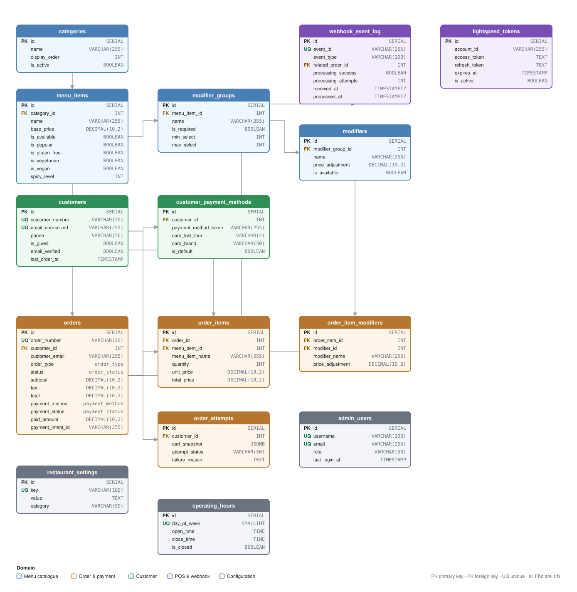

# Asian Taste — Restaurant Ordering Data Platform

## Overview

**Asian Taste Vietnamese Cuisine** (329 Henley Beach Rd, Brooklyn Park, Adelaide) takes
orders online: a customer browses the menu, customises a dish, pays by card or Apple Pay,
and collects it in-store. Behind that storefront is a small **operational data platform** —
a normalised OLTP schema, a checkout and payment pipeline, and a POS/webhook integration
layer that keeps the restaurant's point-of-sale system in step with what was actually
ordered.

As a **data/backend engineer**, the work here is building and maintaining pipelines that
are *correct about money*: every order that reaches the kitchen must correspond to a
payment that really cleared, and every refund must be reflected in the numbers the owner
reads at the end of the day. That constraint shapes almost every design decision below —
idempotent webhook handling, an append-only event log, a queue that retries without ever
failing an order, and explicit columns for payment state rather than inferring it.

It is a real production system, not an exercise: **card orders are live**, the API runs on
Fly.io, the database on Neon (Sydney), and the storefront on Vercel.

## Project Goals

- **Model the order lifecycle so payment state is a fact, not an inference.** A paid order,
  a refunded order and an abandoned attempt are distinguishable from the schema alone.
- **Make money-affecting ingestion idempotent.** Stripe delivers webhooks more than once;
  the pipeline must not create a second order or a second confirmation email for one charge.
- **Never lose an order to a downstream failure.** The POS sync is queued and retried — a
  failure at the till must not turn a paid order into a user-facing error.
- **Leave an auditable trail.** Every webhook payload, every failed attempt and every
  status transition is recorded, so "what happened to order 42" is answerable from data.
- **Keep the schema honest as it evolves.** Migrations are ordered, idempotent and applied
  at boot; the diagram below is generated and checked against them.

## System Architecture



<sub>Generated from the migrations. Regenerate with `python3 scripts/schema-diagram.py`;
verify with `python3 scripts/check-schema-diagram.py` (structure) and
`python3 scripts/check-schema-layout.py` (no overlapping boxes, no clipped types).</sub>

The data flows one way, and each hop is a place a failure can be lost or recorded:

```
Customer app ──▶ API ──▶ PostgreSQL ──▶ Admin dashboard (kitchen)
                  │  │
                  │  └──▶ Stripe ──▶ webhook_event_log ──▶ order status + email queue
                  │
                  └──▶ OrderSyncBackgroundService ──▶ Lightspeed POS (queued, retried)
```

## Data set

Production is a small, fully normalised OLTP set rather than an analytics warehouse. Real
volumes at the time of writing:

| Entity | Rows | Notes |
|---|---|---|
| `menu_items` | 82 | across 14 `categories`; every item has modifier groups |
| `categories` | 14 | Starters, Pho, Rice Dishes, … |
| `modifier_groups` / `modifiers` | seeded | the printed menu's options (size, protein, spice) |
| `orders` | transactional | pickup only in v1 |
| `order_items` / `order_item_modifiers` | transactional | line-level, with a *snapshot* of name and price |
| `webhook_event_log` | append-only | one row per Stripe event, with a unique `event_id` |

Two modelling decisions are worth calling out, because both are the kind of thing that is
painful to retrofit:

**Line items snapshot their own name and price.** `order_items` stores `menu_item_name`,
`unit_price` and `total_price` rather than only a foreign key to `menu_items`. A menu price
change must never rewrite the history of an order that was already paid for — the receipt
has to reflect what the customer was actually charged.

**Modifiers snapshot too.** `order_item_modifiers` keeps `modifier_name` and
`price_adjustment` alongside `modifier_id`, for the same reason, and because a modifier row
can be deleted while the order it belonged to must survive.

## Project Workflow

### 1. Schema and migrations

The schema is 13 ordered `.sql` files shipped as **embedded resources** and applied at
boot. The order is forced — schema → de-dupe → conflict index → seed → payment fields →
POS tables → indexes → admin user — because later steps depend on earlier ones existing,
and a reordering silently corrupts databases that already hold data.

Every migration is idempotent (`IF NOT EXISTS`, guarded `DO $$ … $$`), because boot
re-runs the sequence against a database in an unknown state.

```bash
# applied automatically by Data/DatabaseInitializationService.cs at API startup
src/AsianTaste.API/Data/Migrations/*.sql
```

<sub>Regenerate the diagram after changing a migration: `python3 scripts/schema-diagram.py`</sub>

### 2. Order ingestion

`POST /api/orders` is the write path. It validates the cart, prices it, writes
`orders` + `order_items` + `order_item_modifiers` in one transaction, then hands off to
payment. Two properties matter for a data pipeline:

- **Totals are always derived server-side.** Prices are sent by the client, but the server
  recomputes the subtotal from `menu_items.base_price` and each modifier's own price, summing
  per line and rejecting any unknown menu item (`Repositories/OrderRepository.cs:176-194`).
  A tampered request cannot set its own total. Prices are **GST-inclusive** — `tax` is
  deliberately 0, not added at checkout.
- **The order number is timezone-derived**, generated against `Australia/Adelaide` rather
  than UTC, so the number a customer reads out matches the trading day the staff worked.

### 3. Payment + webhook ingestion (the idempotency layer)

Stripe is the system of record for money, and it delivers an event more than once as a
matter of course. The pipeline handles that with a unique key rather than hope:

```
charge.succeeded ──▶ webhook_event_log (UNIQUE event_id, INSERT … ON CONFLICT DO NOTHING)
                          │
                          ├─ payment_intent.succeeded ──▶ orders.status = Confirmed
                          ├─ charge.refunded          ──▶ orders.payment_status = Refunded
                          │                                (or PartiallyRefunded)
                          └─ ✉  confirmation email queued (guarded by email_confirmation_sent)
```

- `webhook_event_log` is **append-only** and records the payload, signature, source IP and
  processing outcome for every delivery. A duplicate delivery is a no-op, not a second
  order.
- `orders.payment_status` is an explicit enum (`Pending → Succeeded → Refunded /
  PartiallyRefunded`), so a refund is a column value rather than something derived from
  Stripe after the fact. Refunds made in the Stripe dashboard converge through the same
  webhook.
- The email queue is drained **outside the request that enqueued it**, so a customer
  closing the tab cannot cancel their own confirmation email.

### 4. POS sync (queued, never blocking)

`OrderSyncBackgroundService` pushes confirmed orders to Lightspeed. The rule is absolute:
**the customer has already paid, so a POS failure queues and retries and never fails the
order.** Failures are recorded with a reason and an attempt count, and surface on
`/health/pos` as a backlog the staff can act on. This is the pattern for every downstream
integration here — the order is the durable fact, the sync is best-effort.

### 5. Reporting and verification

The admin dashboard reads aggregates over `orders` (daily totals, status counts). Two habits
keep those numbers trustworthy:

- **Guardrail scripts** assert the data layer is intact rather than trusting a green build:
  `check-test-wiring.sh` (every test file can actually run), `check-test-health.sh` (the
  suite ran, nothing skipped, the count did not shrink below `.test-baseline`),
  `check-ci-integrity.sh` (the guardrails are still armed).
- **A deployed health check** proved by query rather than by assertion:
  `./scripts/check-deployment-health.sh` asserts the API responds, the database reports its
  menu size, there are no duplicate dishes, and the Development-only `/api/dev/db/*`
  endpoints 404 in production.

```bash
./scripts/check-deployment-health.sh   # live stack, including row counts and prod posture
```

### 6. Backups

Neon's free tier has **no automated backups**, so the only copy of the orders table was the
running database. `scripts/backup-db.sh` takes a custom-format dump, checks it reads back
with `pg_restore --list` *before* declaring success, and stages through a `.partial` name so
an interrupted run cannot leave a truncated file that looks restorable.

```bash
./scripts/backup-db.sh --out ~/backups --keep 30
```

<sub>Not scheduled yet — see decision D1 in [`docs/TODO.md`](docs/TODO.md).</sub>

---

## Tech stack

| Layer | Choice |
|---|---|
| Database | PostgreSQL (Neon, `ap-southeast-2`), Dapper with hand-written SQL |
| API | ASP.NET Core (`net10.0`), controllers → services → repositories |
| Customer app | React 19 + Vite + Zustand |
| Admin dashboard | React 19 + Vite + React Query |
| Payments | Stripe (PaymentIntents; Apple Pay/Google Pay via `automatic_payment_methods`) |
| POS | Lightspeed (optional, queued sync) |
| Hosting | API on Fly.io (`syd`), DB on Neon, frontends on Vercel |

## Run the demo

No setup and no local database: everything below runs against the deployed stack.
Nothing you do here takes real money — the API is on **Stripe test keys**, so no
card is ever charged (see [Payments](#payments-test-mode)).

| What | URL |
|---|---|
| Customer app | <https://asian-taste-customer.vercel.app> |
| Admin dashboard | <https://asian-taste-vietnamese-cuisine-wq44.vercel.app> |
| API | <https://asian-taste-api.fly.dev> ([`/health/db`](https://asian-taste-api.fly.dev/health/db) shows whether the database and menu are up) |

**Admin login**

```
username   admin
password   nhahangvietnam
```

> This is the **deployed** password, written down here so a reviewer can get in
> without asking — which means it now lives in git history: **rotate it after the
> review** (see [`docs/DEPLOYMENT.md`](docs/DEPLOYMENT.md)).

## Repository layout

```
src/AsianTaste.API            API + all SQL
  Data/Migrations/*.sql         ordered, idempotent schema migrations (embedded resources)
  Repositories/                 Dapper data access; snake_case → PascalCase mapping is manual
  Services/                     business logic, payment gateways, POS sync, webhook handling
  Controllers/                  thin HTTP layer
  WebSockets/                   live order push to the kitchen dashboard
src/asian-taste-customer      customer storefront
src/asian-taste-admin         kitchen/admin dashboard
src/shared                    order-status vocabulary shared by both apps
tests/AsianTaste.API.Tests    xUnit
scripts/                      guardrails, health checks, backups, schema diagram
docs/                         ARCHITECTURE, DEPLOYMENT, TODO, GUARDRAILS, schema.svg
```

## Running locally

```bash
# 1. API -> http://localhost:5070
cd src/AsianTaste.API
ASPNETCORE_ENVIRONMENT=Development dotnet run    # REQUIRED: without it the API reaches a
                                                  # different database that has no admin
                                                  # tables and 500s on login

# 2. Customer app -> http://localhost:5173
cd src/asian-taste-customer && npm run dev

# 3. Admin app -> http://localhost:5174
cd src/asian-taste-admin && npm run dev
```

Both dev servers proxy to the API on `:5070`.

## Testing

```bash
dotnet test                              # API suite (xUnit)
cd src/asian-taste-customer && npm test  # vitest
cd src/asian-taste-admin    && npm test  # vitest
npm run build && npm run lint            # typecheck is the strongest frontend check
```

Guardrails — run these before calling a data-layer change done:

```bash
./scripts/check-test-wiring.sh   # can every tracked test file actually run?
./scripts/check-test-health.sh   # did the suite really run, and mean something?
./scripts/check-ci-integrity.sh  # are the guardrails still armed?
python3 scripts/check-schema-diagram.py   # is the ERD still the schema?
```

See [`docs/GUARDRAILS.md`](docs/GUARDRAILS.md) for what each one catches, and — importantly —
**what is still not guarded**.

## Where to go next

- **[`docs/ARCHITECTURE.md`](docs/ARCHITECTURE.md)** — how the whole system fits together.
- **[`docs/TODO.md`](docs/TODO.md)** — outstanding work, decisions taken, and how to reverse
  each one. Start here for current state.
- **[`docs/GUARDRAILS.md`](docs/GUARDRAILS.md)** — the checks, and their honest gaps.
- **[`docs/DEPLOYMENT.md`](docs/DEPLOYMENT.md)** — setup and release commands.
- **[`docs/DESIGN/`](docs/DESIGN/)** — the design system behind both front-ends.

Everything else that describes the project is history, not current state, and lives in
[`docs/archive/`](docs/archive/README.md). Review-shaped work is tracked as GitHub
[issues](https://github.com/monsieurkd/Asian_taste_Vietnamese_cuisine/issues).
